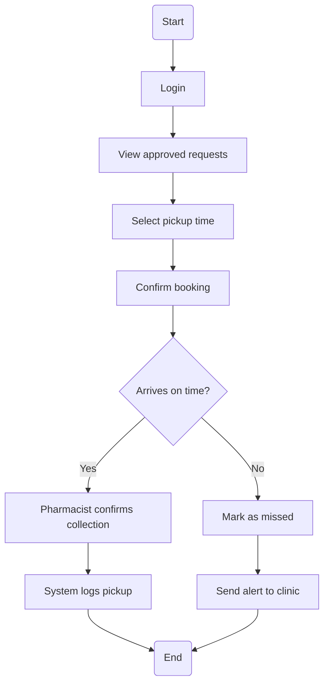
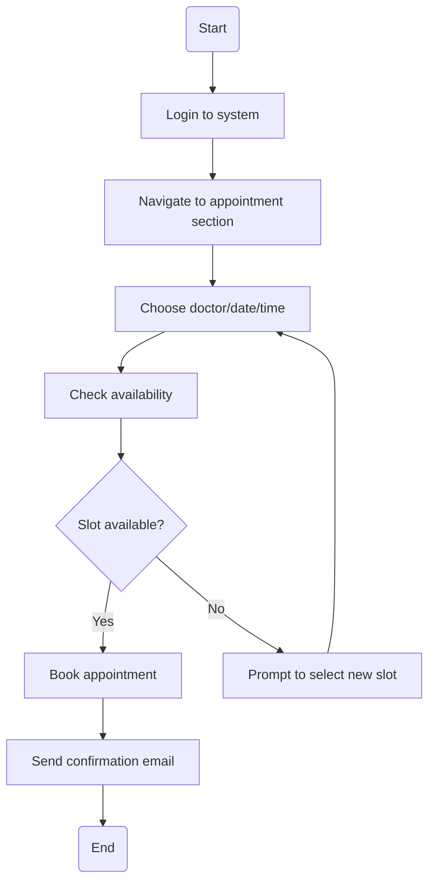
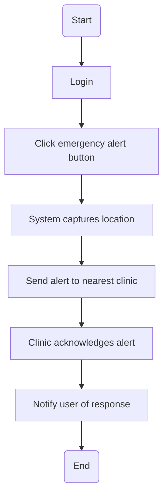
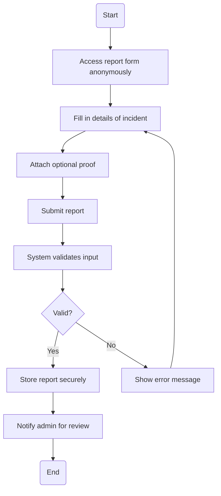
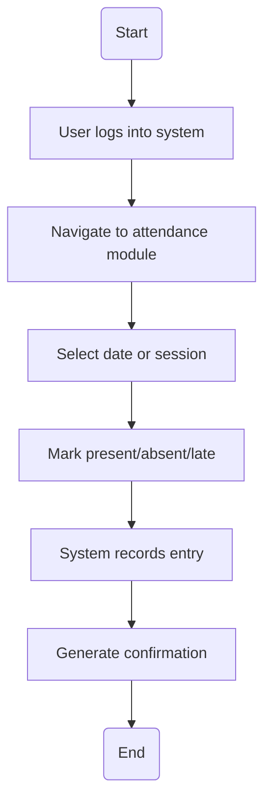
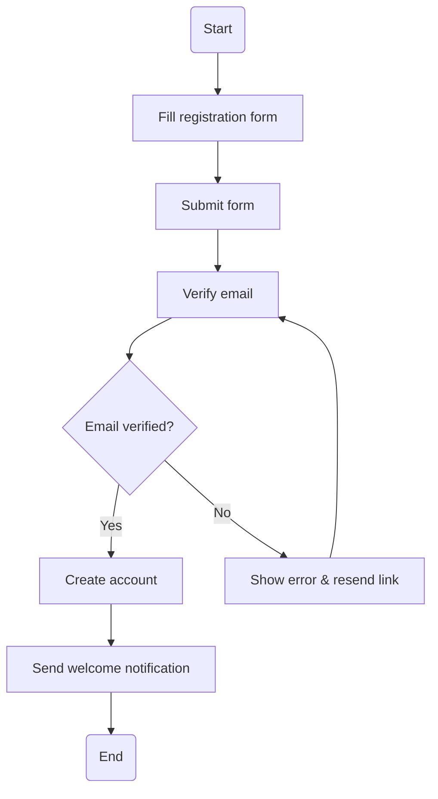

# 📘 Activity Diagrams

## 🎯 Purpose
This document presents **UML-based Activity Diagrams** for key workflows in the medication adherence support system. Each diagram models a user-facing process and links back to specific user stories and functional requirements.

---

## 💊 Activity: `Collect Medication`

### ✅ Explanation
This diagram outlines the **steps a user takes to collect their medication** and how the system responds:

1. **Login** → User logs into the system.
2. **View approved requests** → Check for medications approved for pickup.
3. **Select pickup time** → Choose a convenient time slot.
4. **Confirm booking**.
5. **Decision – Arrives on time?**:
   - **Yes** → Pharmacist confirms, system logs it.
   - **No** → Marked as missed, alert sent to clinic.

🔍 Ensures medication adherence and triggers follow-up.

### 🔗 Traceability
- User Story: *US-005 (pickup reminder)*
- Functional Requirement: *“Log medication pickup and trigger alerts on misses.”*

---

## 📅 Activity: `Book Appointment`

### ✅ Explanation
Shows how a user **books an appointment** with a healthcare provider:

1. **Login**.
2. **Navigate to appointment section**.
3. **Choose practitioner/date/time**.
4. **Check slot availability**.
5. **Decision**:
   - **Available** → Book and send confirmation.
   - **Unavailable** → Prompt user to try another.

🔍 Helps manage clinic scheduling efficiently.

### 🔗 Traceability
- User Story: *US-004 (lecturer schedules appointment)*
- Functional Requirement: *“Users must book appointments with available practitioners.”*

---

## 🚨 Activity: `Trigger Emergency Alert`

### ✅ Explanation
Models how a user **sends an emergency health alert**:

1. **Login** → Gain access to system.
2. **Trigger alert** via button.
3. **System captures location**.
4. **Send alert** to closest clinic.
5. **Clinic acknowledges** and user is notified.

🔍 Enables fast, location-aware emergency response.

### 🔗 Traceability
- User Story: *US-006 (emergency intervention)*
- Functional Requirement: *“Enable fast response to user emergencies.”*

---

## 🕵️ Activity: `Submit Anonymous Report`

### ✅ Explanation
Illustrates how users **submit confidential reports**:

1. **Access form anonymously** – no login.
2. **Enter incident details and attach proof**.
3. **Submit** → System validates:
   - **Valid** → Stored, notify admin.
   - **Invalid** → Error shown, retry.

🔍 Encourages reporting of misuse while protecting identity.

### 🔗 Traceability
- User Story: *US-007 (confidential report)*
- Functional Requirement: *“Allow users to anonymously report misuse or non-compliance with privacy preserved.”*

---

## 🧾 Activity: `Log Attendance`

### ✅ Explanation
Describes how users or lecturers **record attendance**:

1. **Login** → Access system.
2. **Select date/session**.
3. **Mark attendance**.
4. **System logs entry and confirms**.

🔍 Useful for tracking participation or monitoring.

### 🔗 Traceability
- User Story: *US-002 (lecturer marks attendance)*
- Functional Requirement: *“System must log user attendance per session.”*

---

## 👤 Activity: `User Registration`

### ✅ Explanation
Models the process of **new user sign-up and verification**:

1. **User fills registration form**.
2. **Submit** triggers email verification.
3. **Decision – Email verified?**:
   - **Yes** → Create account and welcome user.
   - **No** → Error shown, resend link option.

🔍 Prevents spam accounts and ensures valid contact details.

### 🔗 Traceability
- User Story: *US-001 (account creation)*
- Functional Requirement: *“Allow users to register and activate their accounts via email confirmation.”*
