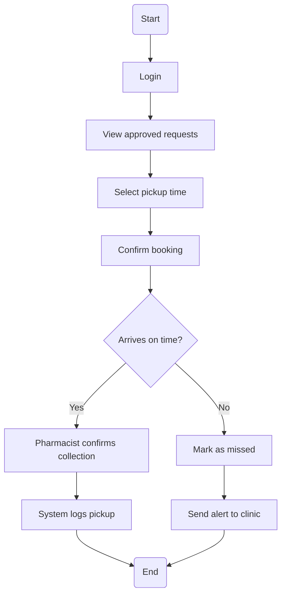
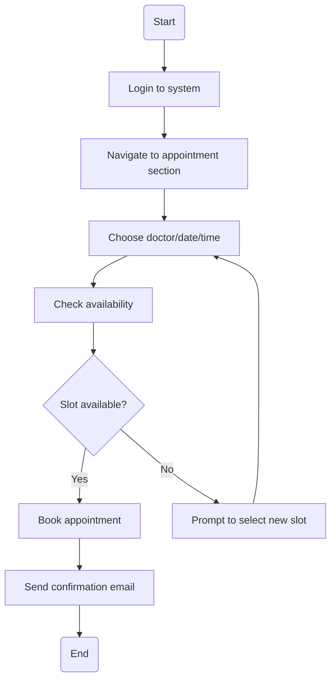
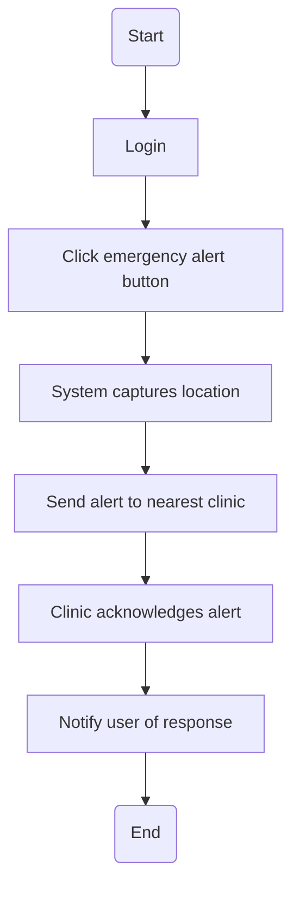
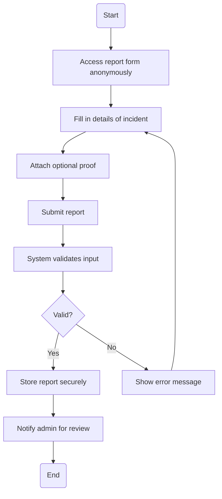
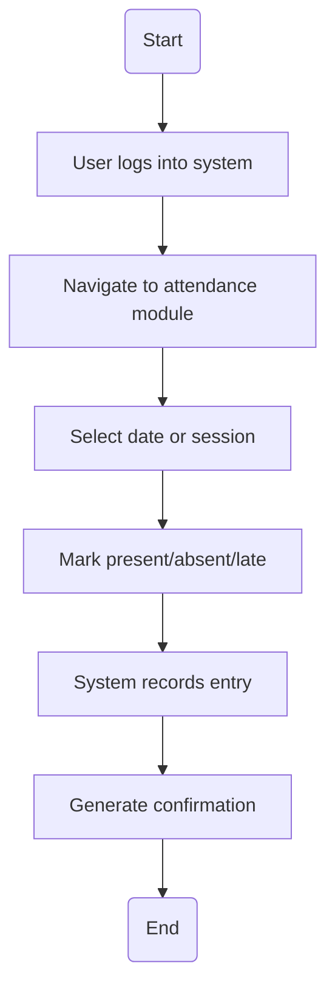

## 💊 Activity: `Collect Medication`

### 🔗 Traceability
- User Story: *US-005 (pickup reminder)*
- Functional Requirement: *“Log medication pickup and trigger alerts on misses.”*

---

## 📅 Activity: `Book Appointment`

### 🔗 Traceability
- User Story: *US-004 (lecturer schedules appointment)*
- Functional Requirement: *“Users must book appointments with available practitioners.”*

---

## 🚨 Activity: `Trigger Emergency Alert`

### 🔗 Traceability
- User Story: *US-006 (emergency intervention)*
- Functional Requirement: *“Enable fast response to user emergencies.”*

---

## 🕵️ Activity: `Submit Anonymous Report`

### 🔗 Traceability
- User Story: *US-007 (confidential report)*
- Functional Requirement: *“Allow users to anonymously report misuse or non-compliance with privacy preserved.”*

---

## 🧾 Activity: `Log Attendance`

### 🔗 Traceability
- User Story: *US-002 (lecturer marks attendance)*
- Functional Requirement: *“System must log user attendance per session.”*
