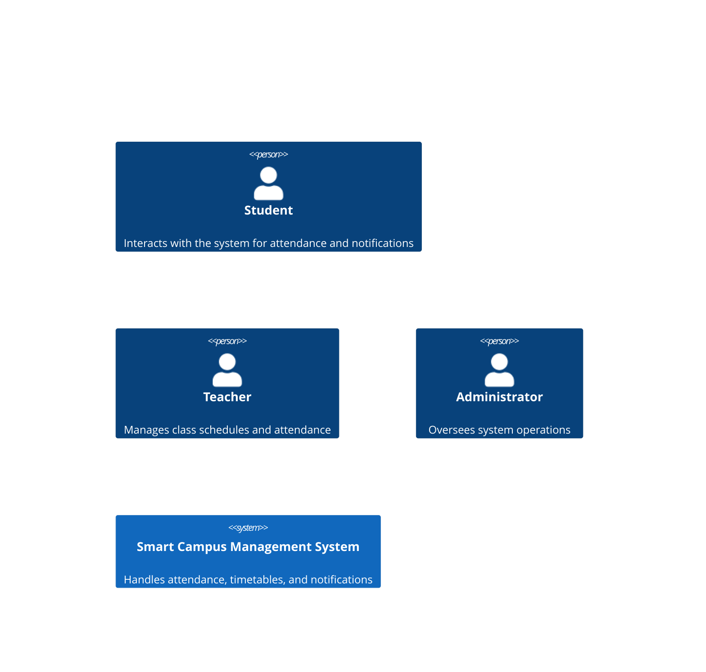
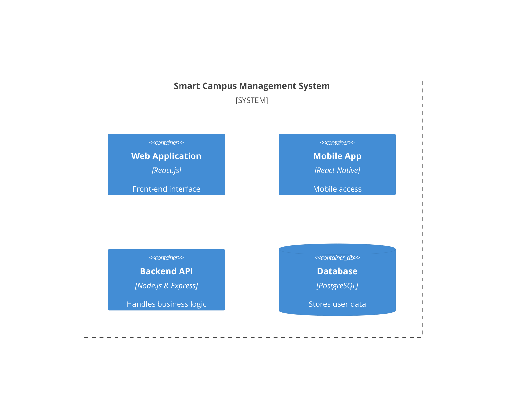
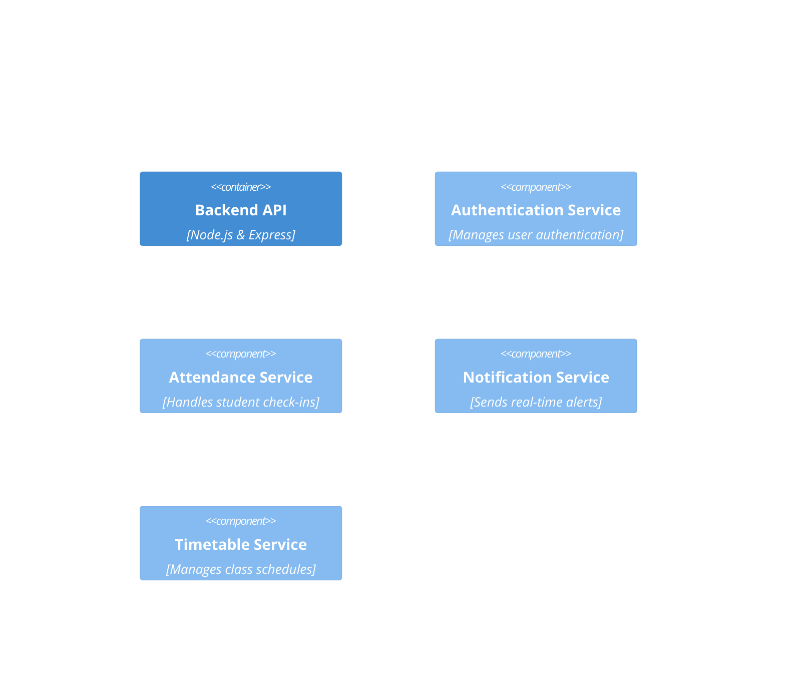

# System Architecture Document

## 1. Introduction

### 1.1 Project Title
**Smart Campus Management System**

### 1.2 Domain
**Education Technology**

### 1.3 Problem Statement
Managing various campus activities like attendance tracking, timetable management, and event notifications manually is inefficient. The **Smart Campus Management System** provides an integrated solution to automate these tasks.

## 2. C4 Model Overview
The system architecture follows the **C4 model**, which consists of four levels:
- **Level 1: System Context Diagram**
- **Level 2: Container Diagram**
- **Level 3: Component Diagram**
- **Level 4: Code Diagram** 

## 3. C4 Diagrams

### 3.1 System Context Diagram

### 3.2 Container Diagram

### 3.3 Component Diagram

## 4. Conclusion
This architecture ensures scalability, maintainability, and efficiency for campus management operations. Future improvements may include AI-powered analytics and deeper integration with learning management systems.
