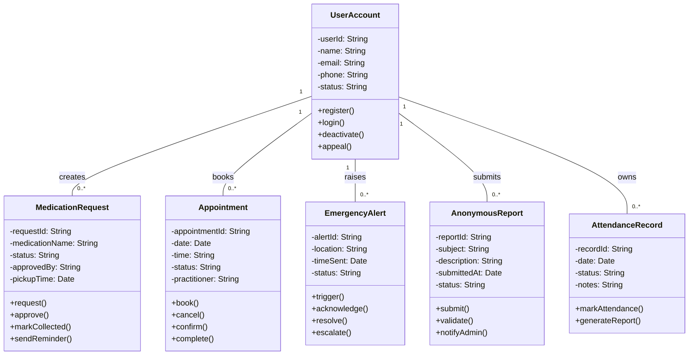

# 🧱 Class Diagram (Mermaid.js)

The following Mermaid.js class diagram illustrates the structural design of the system, including key classes, their attributes, methods, and relationships.

---

### 📝 Design Notes

- This diagram uses **composition and association** to represent relationships between classes.
- The `UserAccount` class is central, managing all key user interactions.
- Each class contains key methods aligned with system use cases and behavior models from previous assignments.
