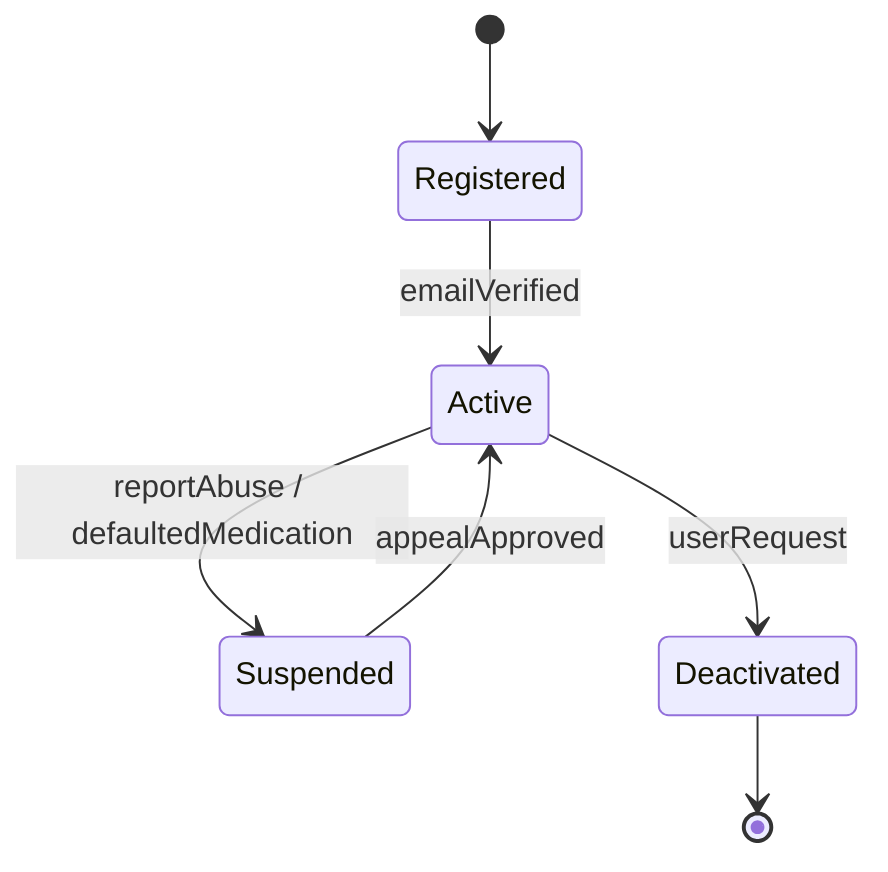
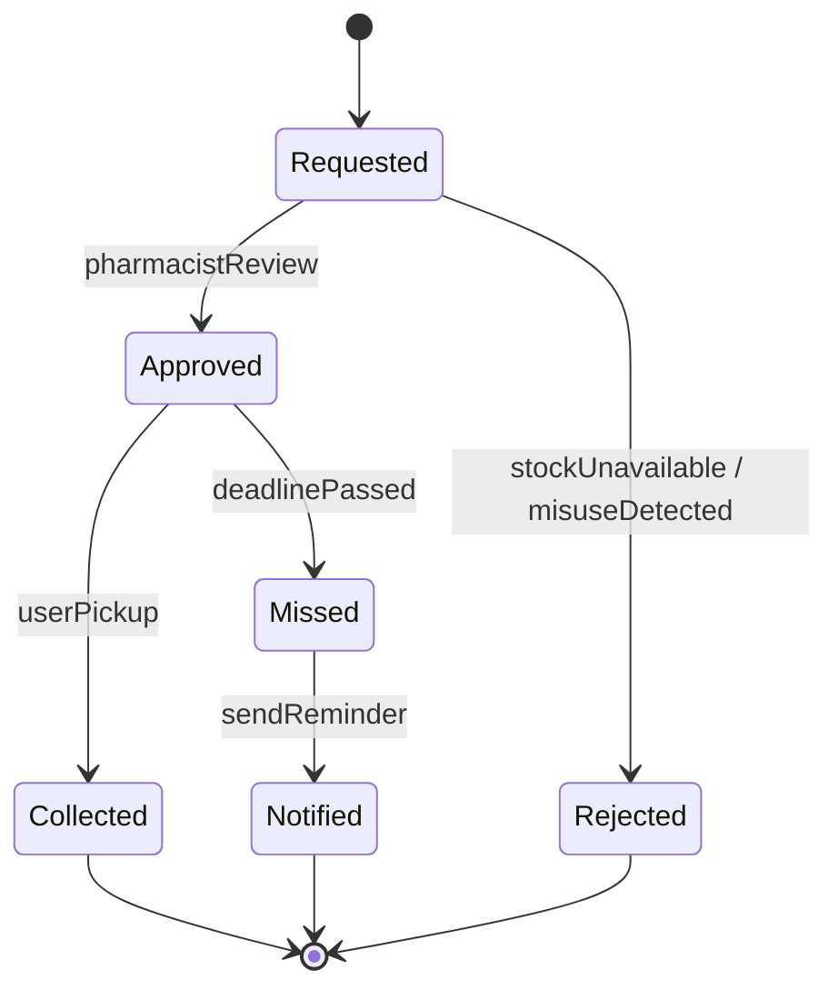
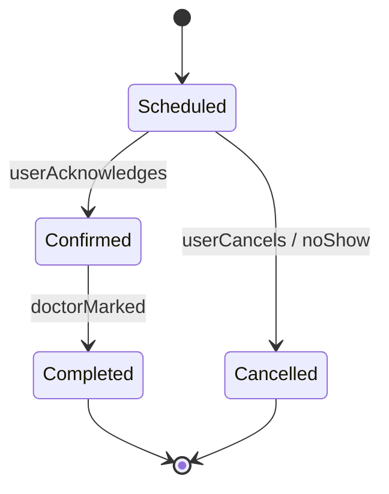
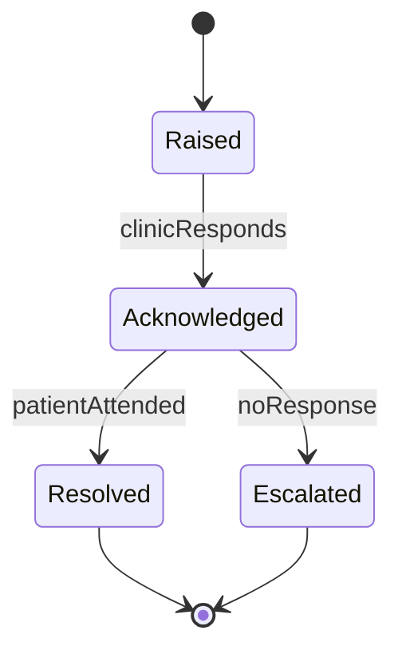
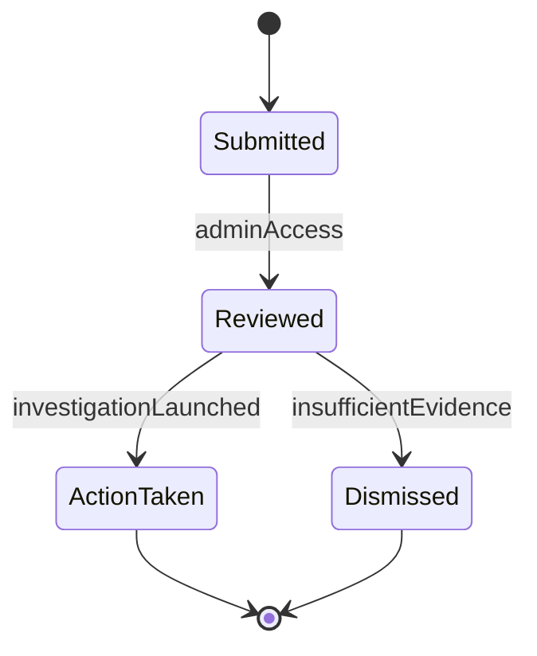
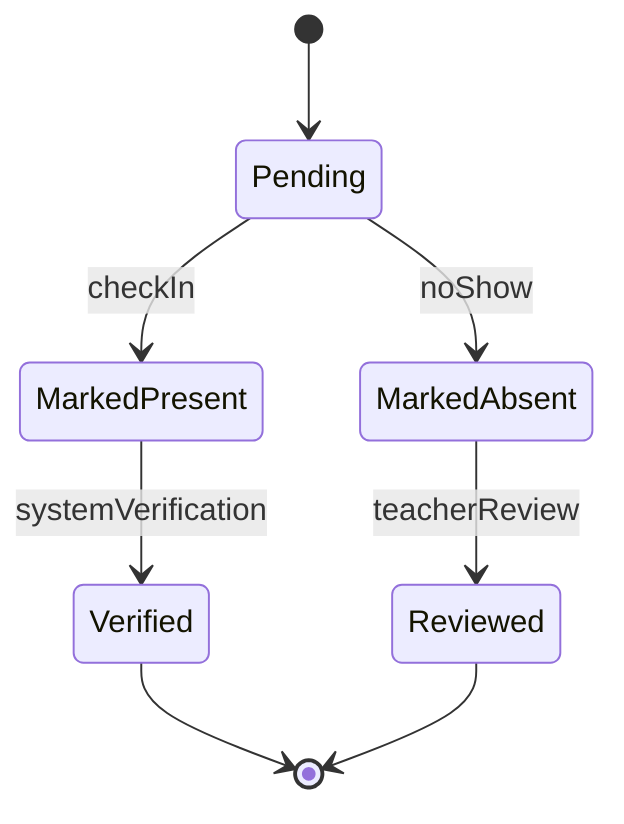

# 📘 State Transition Diagrams

## 🎯 Purpose
This document contains **state transition diagrams** for key system objects, modeled using **UML in Mermaid**. Each diagram is accompanied by a brief explanation and traceability to functional requirements.

---

## 🣍️ State Diagram: `UserAccount`

### ✅ Explanation
- A user starts in the `Registered` state after sign-up.
- Becomes `Active` after email verification.
- Can be `Suspended` for abuse or medical non-compliance.
- Users may `Deactivate` their account or be reinstated via appeal.

### 🔗 Traceability
- Functional Requirement: *“The system must suspend users who default on medications or misuse the alert system.”*  
- User Story: *US-007 (data security)*, *US-003 (parent monitors attendance)*

---

## 💊 State Diagram: `MedicationRequest`

### ✅ Explanation
- Starts at `Requested`, reviewed by the pharmacist.
- Approved requests become `Collected` if picked up or `Missed` if not.
- Missed pickups lead to `Notified` state (alerts sent to user/clinic).

### 🔗 Traceability
- Functional Requirement: *“Track medication collection and send reminders if missed.”*
- User Story: *US-005 (notifications)*, *US-008 (booking)*

---

## 🗓️ State Diagram: `Appointment`

### ✅ Explanation
- Appointments start at `Scheduled`.
- Transition to `Confirmed` if acknowledged by the user.
- May be `Cancelled` or go on to be `Completed` by the practitioner.

### 🔗 Traceability
- Functional Requirement: *“Track appointment lifecycle and manage cancellations.”*
- User Story: *US-004 (lecturer edits schedule)*

---

## ⚠️ State Diagram: `EmergencyAlert`

### ✅ Explanation
- Emergency alerts begin in `Raised` state.
- Can be `Acknowledged` by clinics.
- From there, they are either `Resolved` or `Escalated`.

### 🔗 Traceability
- Functional Requirement: *“Enable users to send emergency alerts to nearest facility.”*
- User Story: *US-002 (lecturer marks attendance)*, *US-006 (admin report generation)*

---

## 🗒️ State Diagram: `AnonymousReport`

### ✅ Explanation
- Reports are `Submitted` anonymously.
- Admin `Reviews`, then takes `Action` or `Dismisses` the case.

### 🔗 Traceability
- Functional Requirement: *“Allow anonymous reporting of misuse or non-adherence.”*
- User Story: *US-007 (data compliance)*

---

## 📅 State Diagram: `Attendance`

### ✅ Explanation
- Attendance starts as `Pending`.
- Transitions to either `MarkedPresent` or `MarkedAbsent`.
- These are later verified or reviewed.

### 🔗 Traceability
- Functional Requirement: *“Enable tracking of learner attendance.”*
- User Story: *US-003 (parent monitors attendance)*
