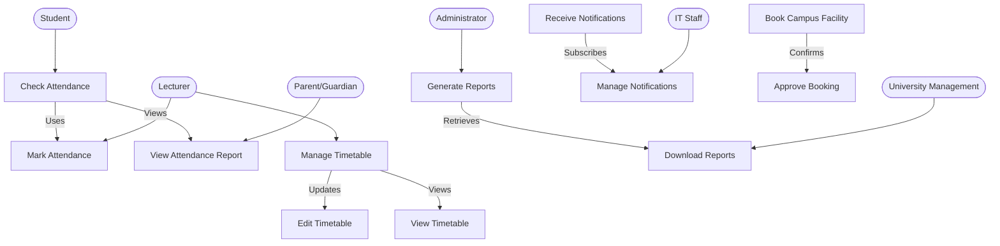

# Use Case Diagram

## Overview
The following UML use case diagram represents how different actors interact with the **Smart Campus Management System**.

## Explanation
- **Key Actors**:
    - **Students**: Check attendance and receive notifications.
    - **Lecturers**: Mark attendance and manage timetables.
    - **Administrators**: Generate reports and approve facility bookings.
    - **IT Staff**: Manage system security and notifications.
    - **Parents/Guardians**: View attendance reports.
    - **University Management**: Download analytics reports.

- **Use Case Relationships**:
    - **Marking attendance** links to **checking attendance**.
    - **Managing timetables** allows both **editing and viewing schedules**.
    - **Receiving notifications** allows managing preferences.
    - **Generating reports** allows downloading data for analysis.

